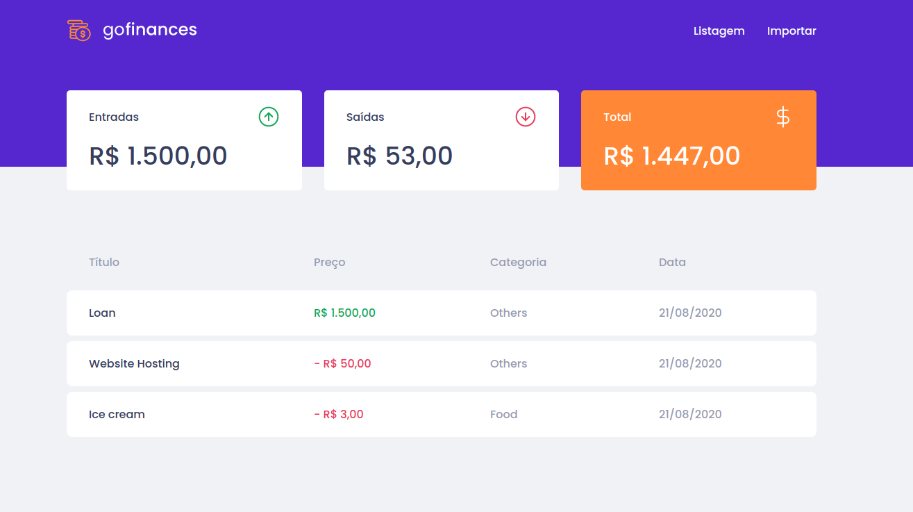
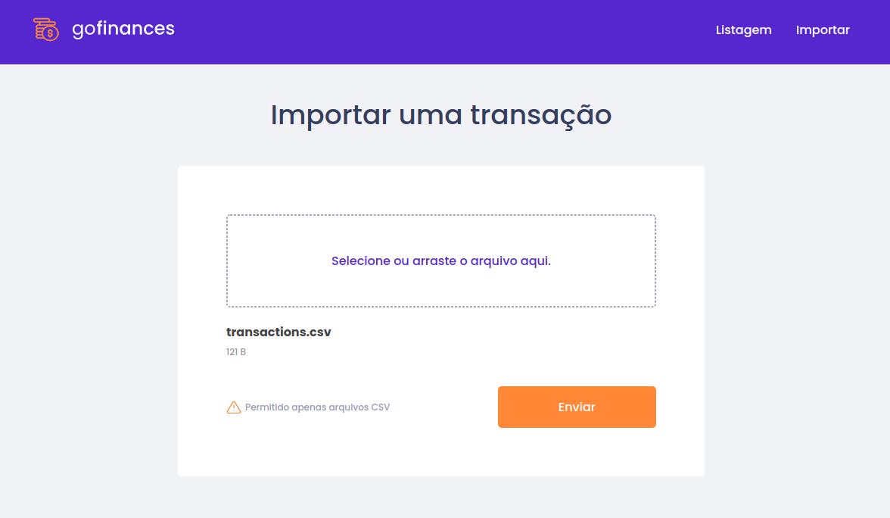

# Bank Web Page

ReactJS project proposal as a challenge by the instructor during the Rocketseat GoStack course to memorize the content.
This is the web page of a Bank project that will manage users' transactions.

## What I learned or did in this project?

- Format the content inside useEffect component to avoid reprocessing.
- Destructuring complex object and array.
- Know dropzone component that manage file upload.

## See the screenshots

